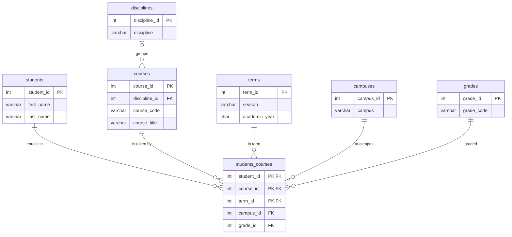

# Summer Electives: Normalized Schema

The Registrar's master spreadsheet is **998 rows × 650 columns**: 6 descriptive columns (`student_id, first_name, last_name, discipline, campus_name, Term & Academic Year`) and 644 course columns named `CODE+Title`, each holding a grade or left blank. Only 1,182 of the 642,712 course cells hold a grade.

## Problems in the original sheet

| Problem | Example | Normal form broken |
|---|---|---|
| Repeating group: one column per course | 644 course columns, 1–4 filled per row | 1NF |
| Non-atomic column header | `MGT-606+Operations Management` (code + title) | 1NF |
| Non-atomic term | `Summer AY12-13` (season + academic year) | 1NF |
| Student name repeated per row | student `23522` is on 6 rows | 2NF |
| Discipline repeated per row | discipline is determined by the course (each of the 139 courses taken has exactly one discipline) | 3NF |

## Tables

| Table | Kind | Columns (PK **bold**, FK *italic*) |
|---|---|---|
| students | entity | **student_id**, first_name, last_name |
| courses | entity | **course_id**, *discipline_id*, course_code, course_title |
| disciplines | lookup | **discipline_id**, discipline |
| campuses | lookup | **campus_id**, campus |
| terms | lookup | **term_id**, season, academic_year |
| grades | lookup | **grade_id**, grade_code |
| students_courses | junction (M:N) | ***student_id*, *course_id*, *term_id***, *campus_id*, *grade_id* |

## Relationship diagram

Drawn like a MySQL Workbench EER diagram. A solid line means identifying (the FK is part of the child's PK); a dashed line means non-identifying (a plain FK column). `||` = one, `<` = many.

```
 ┌──────────────┐                                     ┌──────────────┐
 │ disciplines  │                                     │   grades     │
 │ PK discipline_id                                   │ PK grade_id  │
 │    discipline│                                     │    grade_code│
 └──────┬───────┘                                     └──────┬───────┘
        ┆ ||                                                 ┆ ||
        ┆                                                    ┆
        ┆ 0..<                                               ┆
 ┌──────┴───────┐                                            ┆
 │   courses    │                                            ┆
 │ PK course_id │ ||                               ┌─────────┴──────────┐
 │ FK discipline_id ─────────────────────────────< │  students_courses  │
 │    course_code                                  │ PK,FK student_id   │
 │    course_title                                 │ PK,FK course_id    │
 └──────────────┘                                  │ PK,FK term_id      │
                                                   │ FK    campus_id    │
 ┌──────────────┐ ||                               │ FK    grade_id     │
 │  students    │ ────────────────────────────────<└──┬────────┬────────┘
 │ PK student_id│                                     │        ┆
 │  first_name  │                                     ^        ┆ (many)
 │  last_name   │                                     │        ┆
 └──────────────┘                                  ┌──┴────┐ ┌─┴───────────┐
                                                   │ terms │ │  campuses   │
                                                   │PK term_id│PK campus_id│
                                                   │season │ │  campus     │
                                                   │academic_year└─────────┘
                                                   └───────┘
```

Mermaid version (renders on GitHub):



## Relationships

| Relationship | Type | Why | Implemented by |
|---|---|---|---|
| **students ↔ courses** | **M : N** | a student takes many courses; a course is taken by many students | junction table `students_courses` |
| students → students_courses | 1 : M (identifying) | | `student_id` in PK |
| courses → students_courses | 1 : M (identifying) | | `course_id` in PK |
| terms → students_courses | 1 : M (identifying) | the same course can be repeated in another term | `term_id` in PK |
| campuses → students_courses | 1 : M (non-identifying) | campus describes one enrollment | plain FK |
| grades → students_courses | 1 : M (non-identifying) | one grade per enrollment | plain FK |
| disciplines → courses | 1 : M (non-identifying) | every course is in exactly one discipline (checked) | plain FK, like `shows.show_type_id` |

### Why only one M:N junction table

In the Netflix example, a show has several genres and several countries **independently**, so each gets its own junction table (`shows_genres`, `shows_countries`). Here that test fails for everything except student ↔ course:

* **discipline**: each course has exactly one discipline, so it is 1:M (an FK on `courses`), not M:N. A `courses_disciplines` table would allow invalid data.
* **campus, term, grade**: these are not independent facts about a student. They belong to one specific enrollment ("student 78 took ADV-7525 at Sao Paulo in Summer AY12-13 and got A"). Separate `students_campuses` or `students_terms` tables would lose which course was taken where and when. 70 students studied at more than one campus, so that information matters. They therefore go on the junction row, the same way `shows_artists_roles` carries `role_id` together with `show_id` and `artist_id`.

### Row counts

| students | courses | disciplines | campuses | terms | grades | students_courses |
|---|---|---|---|---|---|---|
| 423 | 644 (139 taken) | 17 | 9 | 12 | 14 | 1,182 |

The 505 courses nobody took have `discipline_id = NULL`, because the sheet never shows their discipline. Joining the tables back together reproduces all 1,182 grade cells of the CSV exactly.

## Files

* `summer_electives_schema.sql`: tables only (run this first).
* `summer_electives_normalized.sql`: tables plus all data.
* `build_normalized.py`: regenerates both from the CSV: `python3 build_normalized.py registrar.csv`

To get the graphical diagram, load the schema into MySQL Workbench, then use **Database → Reverse Engineer** (or File → New Model → Create EER Model from Database).
